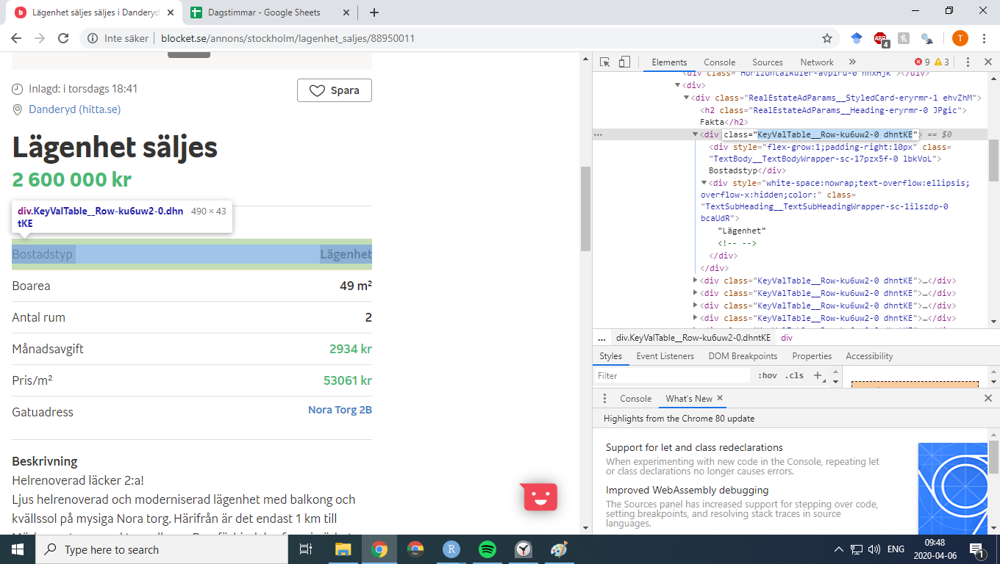
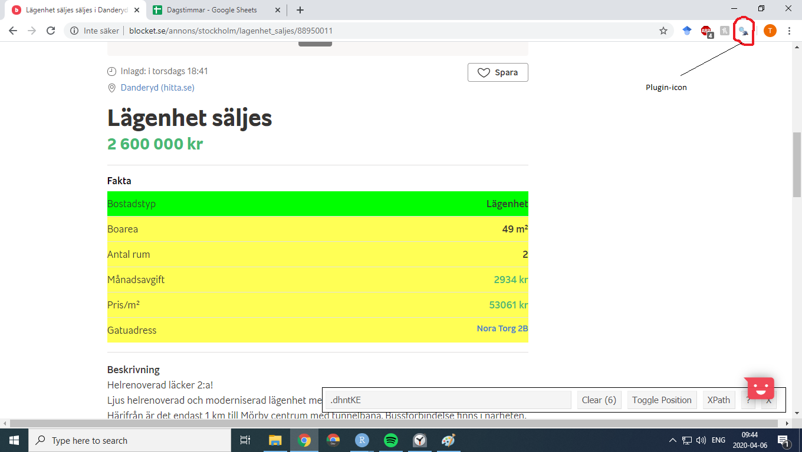

```{r setup, include=FALSE}
knitr::opts_chunk$set(echo = FALSE)
library(leaflet)
library(tidyverse)
library(RSQLite)

conn <- dbConnect(RSQLite::SQLite(), "../Data/df.db")
df <- dbReadTable(conn, "df") %>% 
  mutate(Cluster = factor(Cluster, levels = c(3,2,1)))

dbDisconnect(conn)
```
# Tutorial content

## Outline
- Brief explanation of webbsite-structuring
- Intro to rvest
- Example of how to build scraping functions
- Demo of how to acquire blocket data
- Demo of how to wrangle scraped data
- Demo of how to analyse scraped data

# The details 
## Inspector

```{r}

```

## Selector
```{r}

```

## Data processing
### Acquiring blocket data
- Scraping input: Find number of listing-pages and selectors for wanted ad-content
- Get first listing-page url
- Generate urls for all listing-pages using start url
- Download all listing-pages
- Scrape all listings pages for ad urls
- Download ads

### Scraping process
- Format data
- Filter data

# Results
## Positions
```{r, message=FALSE}
m <- leaflet(df) %>%
    addTiles() %>%  # Add default OpenStreetMap map tiles
    addMarkers(clusterOptions = markerClusterOptions())
m
```

## Prices
```{r}
df %>%
  group_by(Cluster) %>% 
  summarise(C_min = min(Price), C_max = format(max(Price), scientific = FALSE)) %>%
  inner_join(df, by = "Cluster") %>% 
  mutate(Cluster = str_c(Cluster, ": ", C_min, "-", C_max, "sek")) %>% 
  mutate(Cluster = factor(Cluster, levels = unique(Cluster))) %>% 
  ggplot(aes(x = fct_infreq(County), fill = Cluster))+ 
  geom_bar() +  
  theme(axis.text.x = element_text(angle = 35)) +
  scale_fill_manual(values=c("red", "orange","green4")) +
  labs(x = "County", y = "Observations")
```

# Lessons learned
## For next time
- If you wrangle too much, you're scraping wrong
- User freedom = wrangling hell
- Real data = REAL ammount of influences

