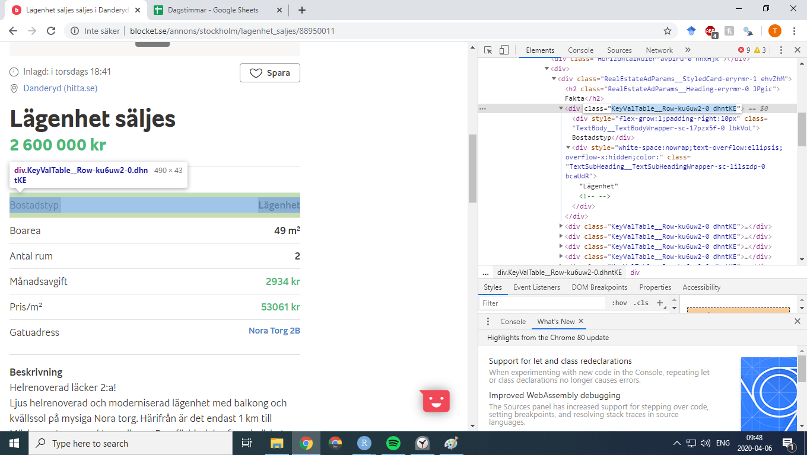
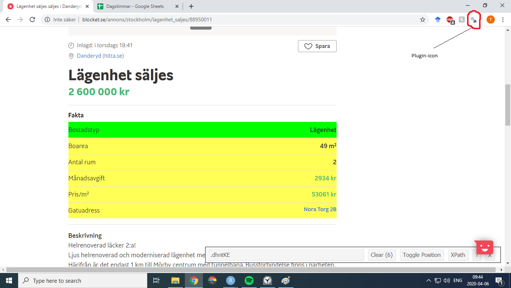

```{r setup, results='hide', message=FALSE, warning=FALSE, echo=FALSE}
library(tidyverse)
library(rvest)
library(rstudioapi)
library(httr)
library(jsonlite)
library(leaflet)
library(RSQLite)
```

```{r, results='hide', message=FALSE, warning=FALSE, echo=FALSE}
# This should set the sets the correct directory. "If" is used as rstudioapi functions prevent knitting.
if(isAvailable()){
  this.directory <- dirname(getSourceEditorContext()$path)
  knitr::opts_knit$set(root.dir = this.directory)
}

source("../R/user_input.R")

source("../R/functions/page_scrapers.R")
source("../R/functions/site_scrapers.R")
source("../R/functions/downloaders.R")
source("../R/functions/clustrer.R")
source("../R/functions/geocoder.R", encoding = "utf-8")

source("../R/functions/sql.R")

if(isAvailable()){
  source("../R/functions/extra.R")
}

#Load the data for this report the fast way using saved result
df <- get_latest_df() %>% 
  mutate(Cluster = factor(Cluster, levels = c(3,2,1)))

#DO NOT UNCOMMENT THE LINE BELOW IF YOU ARE NOT WILLING TO DOWNLOAD ALL DATA FROM SCRACH AND FIX DEPENDANCIES FROM CURRENT DATA
#source("../R/setup/1_download_files.R")

################  Uncomment code below to create dataframe using the "Data"-folder  ##########
 # source("../R/setup/2_create_raw_df.R", encoding = "utf-8")
 # source("../R/setup/3_format_df.R", encoding = "utf-8")
 # source("../R/setup/4_filter_df.R", encoding = "utf-8")
 # source("../R/setup/5_finalize_df.R", encoding = "utf-8")
```

# Introduction
Every data-analysis needs a dataset. Many sites provide data, but sometimes you want specific data from a specific webbsite. That is when webb-scraping becomes handy. If you see something on a webbpage it lets you download all elements of that type, to allow the specific analysis you were looking for.

The contents of this tutorial will teach basic webbscraping using the `rvest` package in R. To display how this may be used in practice, the Swedish marketplace [blocket.se](https://blocket.se) will be scraped for ads selling appartments. Furthermore a sample analysis will be provided, to display what type of investigations can be performed using scraped data. 

## Prerequisites
This tutorial is best suited for intermediate R users or others who are familiar with programming.

Datawrangling is a very important part of webbscraping, as the scraped raw data will need formatting before analysis. Hence familiarity with dataformatting packages within tidyverse such as `dplyr` and `str_c` is recommended.

## Brief introduction to webbpage-structure
In a comic book, we can say that pages consist of two things: **content** such as raw text and lines that are used to populate the page, and **styling** that applies effects and colors to the content. Webb-pages can be compared to comic books as they generally are made up of:

* `HTML`: Code that contains/builds the content of the page, e.g. text, headings, images and links.
* `CSS`: Code that styles the HTML.

In the HTML document that contains the page, content is usually added using tags. There are different tags for different types of content. The "Links" heading is inserted using the h-tag as follows `<h>Links</h>`, while a link to blocket is inserted using `<a href="https://blocket.se"> click me </a>`. 

Together the above would produce:
<h>Links</h>
<a href="https://blocket.se"> click me </a>

Most webbsites you've seen are divided into different sections and groups, where text-size, font and color of e.g. a heading may differ. Using the comic book analogy, we can compare this to how text differs in style when in speech bubbles, compared to when it denotes sounds such as "SWOOOOSH". Sections in html are usually created using div tags. To allow a group of divs to be styled the same way, they are assigned to classes that the CSS can target. We would put our html from before into a class called "Link_class_5" as follows:
```
<div class = "Link_class_5">
  <h>Links</h>
  <a href="https://blocket.se"> click me </a>
</div>
```
When scraping we will use classnames and tags to select content that we want to scrape. How to find classnames - also reffered to as *selectors* - and tags will be described in the next section. 

## Tools for finding classnames and tags
There are many ways to find webb content, here we will describe how to use the html-inspector that's built into google's chrome browser and the [selecor-gadget](https://chrome.google.com/webstore/detail/selectorgadget/mhjhnkcfbdhnjickkkdbjoemdmbfginb?hl=en) browser plugin. The selector can only be reiled on when the chosen element is unlikely to be mixed up with others, but has it's worth in beeing easier to use. 

### Chrome inspector
If you highlight some text within the chrome browser and then press ctrl-shift-i, a sidepane displaying the relevant html for that element will be opened as below:
```{r echo=FALSE, fig.cap="**Image 1:** Displays the inspector opened on a blocket ad's html element"}

```

In Image 1 we can see that the classname of the price element in the the following html:
```
<div class="KeyValTable__Row-ku6uw2-0 dhntKE">
  <div style="flex-grow:1;padding-right:10px" class="TextBody__TextBodyWrapper-sc-17pzx5f-0 lbkVoL">
    Bostadstyp
  </div>
  <div style="white-space:nowrap;text-overflow:ellipsis;overflow-x:hidden;color:" class=
  "TextSubHeading__TextSubHeadingWrapper-sc-1ilszdp-0 bcaUdR">
    Lägenhet
  <!-- --> </div>
</div>
```
The (very long) classname that is used when scraping the div is `TKeyValTable__Row-ku6uw2-0 dhntKE`.

### Selector browser plugin
After having installed and activated the selector gadget, it helps you find selectors by:

1) Clicking the element whose selector you want. The gadget will now display a classname and mark the selected/clicked element in green.
2) Elements marked with yellow are also included with the displayed classname. If any unwanted elements are marked, you simply click/deselect them so they turn red.

If we select the same price information as in Image 1, we get the following image: 
```{r echo=FALSE, fig.cap= "**Image 2:** Displays the selector-gadget opened on a blocket ad's html element"}

```

The difference here is that we don't have to view the html and that the resulting classname contains only the last part of the above, namely `dhntKE`.

## Enough rverst for this tutorial
In this section I will mention the basic use of the core `rvest` functions. I will leave it to the reader to check the [full documentation](https://cran.r-project.org/web/packages/rvest/rvest.pdf) for specific details.

### Reading HTML
The most fundamental function that we'll use is `read_html(file/url)`. Given a file-path or an url, it will return its html to allow for scraping. 

### Filtering HTML
`html_nodes(html, query)` can take the output of `read_html` and search for specific tags/selectors using `xpath` or `css`. It will then output the html that fits those search criteria. Getting the blocket-tables htmlcontent (using results from selector-gadget) from the previous section would look as follows:
```
url <- "https://www.blocket.se/annons/stockholm/lagenhet_saljes/88950011"
html <- read_html(url)
nodes <- html_nodes(html, `.dhntKE`)
```
`nodes` then contains all tags matching the selector:
```{r, echo=FALSE}
nodes <- read_html("for_the_report/example.html") %>% 
  html_nodes(".dhntKE")
nodes
```

We see now that we extracted all divs containing the rows in the table and that the text element we want seems to be within style tags. Tags within a tag are reffered to as the children of that tag. So the function we want now is `html_children(html)` which extracts all of the tags within supplied tags. 
```
children <- html_children(nodes)
```
That yields the following:
```{r, echo=FALSE}
children <- html_children(nodes)
children
```

### Extracting from HTML
Having the results on html-format makes analysis hard. We want the results from the `<style>` tags as text. That can be done using `html_text(html)`:
```
html_text(children)
```
```{r, echo=FALSE}
html_text(children)
```

# Data acquisition
To scrape ad-pages, you need their urls. Almost always they will be avaliable through listing-pages such as the following:
```{r echo=FALSE, fig.cap= "**Image 3:** Displays the listing-page for blocket's apartements"}
knitr::include_graphics('for_the_report/listings.png')
```

Our goal here will be to start with the first listing-page url with selectors for wanted elements, and end up with a dataframe where each observation is an ad with the columns corresponding to the selectors matches. 

From a birdseye the process will be:

0) Find number of listing-pages and selectors for wanted ads plus listing-page content
1) Get first listing-page url
2) Generate urls for all listing-pages using start url
3) Download all listingspages
3) Scrape all listingspages for ad urls
2) Download ads

This will be done by first creating functions for scraping/downloading and then setup-scrips that use the functions to perform the steps above. 

## Acquisition functions
The needed functions will be presented below, while the full code can be viewed in the appendix.

### Functions for downloading: [downloaders.R](#downloaders.R){#adownloaders.R}
As we are going to download a lot of html files using urls, we need a function that takes an array of urls and downloads all corresponding files into a folder. The function `download_pages(url_array, folder_name)` was implemented to do exactly that. To distingush the files it creates, it names them using ascending numbers.

The function `next_ad_page(listing_page, desired_page_number)` was also created. It outputs urls for any listing_page, given a listingspage-url. 

### Functions for scraping one page: [page_scrapers.R](#page_scrapers.R){#apage_scrapers.R} 
In the intro to rvest, we saw that given a selector and a html file, we were a few steps away from an array with our wanted content. Hence we will create functions for scraping using selector-gadget selectors, class-names, blocket-tables (as in the example) and urls.

`scrape_selector(html, selector)` and `scrape_urls(html, url_Selector, page_home)` both work with selector-gadget selectors to return the desired text element(s) or page urls respectively. In `scrape_urls`, `page_home` is the start/home page of the webbsite. 

To scrape using classnames (usually found with the inspector) `div_text(html, div_class)` and `div_html(html, div_class)` were created. The former operates as `scrape_selector` while the latter returns the filtered html instead of strings. 

The blockettable shown in the examples is really hard to scrape across ads. This as the rows of the table may be missing, which makes it hard to predict the result. Hence `scrape_table(html, div_class)` was implemented to scrape the whole row and use the rownames as column-names to output a dataframe. This will allow the output to contain more information to format with.

### Functions for scraping several pages: [site_scrapers.R](#site_scrapers.R){#asite_scrapers.R}
Having functions that scrape one page, it is easy to generalize the results to several pages. 

As we will want to scrape both stored html files and webb content, two different scrapers that output arrays were made:

* `scrape_pages(start_page_url, n_pages, selector, scraper)` uses one of the selectors above to scrape the selector on the specified number of pages after the supplied listing page. 
* `scrape_files(folder_path, selector, scraper)` operates as the above, but expects the pages to be in a specified folder instead of a webbpage. 

### Functions for saving/loading the data to/from a sql-database: [sql.R](#sql.R){#asql.R}
Downloading and processing the data into a dataframe will take a long time, hence we will create functions to save the resulting dataframe into a sql database using the `RSQLite` package. 

`save_latest_df(table = df)` will save a supplied dataframe into a sql database. As we will name the final dataframe "df", this function has that as default argument. The function that loads the dataframe back into r is `get_latest_df(table = "df")`.

## Aquiring the data
Now that we have all the scraping-knowledge and functions in place, we'll setup all selectors and paths that are needed in a file with global variables and then download the data. 

### Global variables: user_input.R
```{r cache=FALSE, echo=FALSE}
      knitr::read_chunk('../R/user_input.R')
```
```{r user_input.R, eval=FALSE}
```
### Downloading the data: 1_download_files.R
```{r cache=FALSE, echo=FALSE}
      knitr::read_chunk('../R/setup/1_download_files.R')
```
```{r 1_download_files.R, eval=FALSE}
```
# Data processing
Now that we have the data avaliable on disk, we will have to perform some steps to get it into a dataframe. 

## Creating dataframe with raw data: 2_create_raw_df.R
The ads will be converted to a dataframe by scraping their table-like structure, price and title. Futhermore we will use the downloaded pages to exctract the county and title for each ad. 
```{r cache=FALSE, echo=FALSE}
      knitr::read_chunk('../R/setup/2_create_raw_df.R')
```
```{r 2_create_raw_df.R, eval=FALSE}
```

## Formatting the raw dataframe: 3_format_df.R
To be able to analyse the data systematically, numbers need to be cast from string format. We will also ensure that columnames are userfriendly. 
```{r cache=FALSE, echo=FALSE}
      knitr::read_chunk('../R/setup/3_format_df.R')
```
```{r 3_format_df.R, eval=FALSE}
```
## Filtering the formatted dataframe: 4_filter_df.R
Here we will correct and exclude data to raise its quality. Prepaing the data-set, it is important to view the data, to understand why certain observations are included in a group. Hence the function `open_files(Ids)` was created in [extra.R](#extra.R){#aextra.R}. It takes Ids from the dataframe and opens their html-files in a chrome-browser.

In the filter-section of the code the filtrationcritera are displayed as comments.
```{r cache=FALSE, echo=FALSE}
      knitr::read_chunk('../R/setup/4_filter_df.R')
```
```{r 4_filter_df.R, eval=FALSE}
```

## Adding columns and making a snapshot of the dataframe: 5_finalize_df.R
A final step for dataprocessing is to add variables and save the result to not have to redo all the calculations. 

Here we will add the longitude and latitude of ads in two columns `lng` and `lat`. Furthermore the prices will be clustered into three groups: high, medium and low, represented by the numbers 3-1 respectively.
That data is created using [geocoder.R](#geocoder.R){#ageocoder.R} and [clustrer.R](#clustrer.R){#aclustrer.R}, which you can read more about in the appendix. 
```{r cache=FALSE, echo=FALSE}
      knitr::read_chunk('../R/setup/5_finalize_df.R')
```
```{r 5_finalize_df.R, eval=FALSE}
```

# Examples of data-analysis
Here a sample of the analysis one can perform on scraped data will be shown.

## Investigate distribution
Investigating the spread and distribution of collected data is a given first step. One type of plot that does that is the violinplot:
```{r, echo=FALSE, fig.cap="**Fig 1:** Displays the violinplot for each of our numeric variables"}
df %>% 
  select(Area, Rooms, Rent, Price_m2, Price) %>% 
  gather(key = "Variable", value = "Value") %>% 
  ggplot(aes(x = Variable, y = Value)) + geom_violin(color = "red", fill = "darkgrey")+ facet_wrap(~Variable, scales = "free")+ geom_boxplot(width=0.04) 
```

We see that all variables seem to have outliers for high values. Furthermore, we can see that Pris and Pris_m2 have quite similar distributions, which isn't surprising as Pris_m2 is a scaled version of Pris.

Most types of ads will be affected by their geographical postion. Hence, it may be interesting to find the geographic spread of listings too:
```{r, echo = FALSE, message=FALSE, fig.cap="**Fig 2:** Displays a clusterplot of apprtements geographical position"}
m <- leaflet(df) %>%
    addTiles() %>%  # Add default OpenStreetMap map tiles
    addMarkers(clusterOptions = markerClusterOptions())
m
```

In Fig 2 we can see four clusters, where the largest ones are in the lower part of Sweden. If there are regional differences in prices, it may be suitable to analyse these regions sepparately. 

To investigate if there are regional differences in prices, we use the clusters in a barplot as that will give an indication of each county's weight and size. 

```{r, echo=FALSE, fig.cap="**Fig 3:** Displays the number of observations per county with their respective cluster distribution"}
df %>%
  group_by(Cluster) %>% 
  summarise(C_min = min(Price), C_max = format(max(Price), scientific = FALSE)) %>%
  inner_join(df, by = "Cluster") %>% 
  mutate(Cluster = str_c(Cluster, ": ", C_min, "-", C_max, "sek")) %>% 
  mutate(Cluster = factor(Cluster, levels = unique(Cluster))) %>% 
  ggplot(aes(x = fct_infreq(County), fill = Cluster))+ 
  geom_bar() +  
  theme(axis.text.x = element_text(angle = 35)) +
  scale_fill_manual(values=c("red", "orange","green4")) +
  labs(x = "County", y = "Observations")
```

In Fig 3 we see that most prices fall within the low-price category. However, Stockholm's county is a region that raises questions, as it has a marginally higher weight and magnitude than all other countys.

## Finding trends
One way of investigating trends is to try to construct a linear model. The first step is to evaluate the correlation between our variables.
```{r, echo = FALSE}
cor(df %>% select(Price, Area, Rooms,Rent,Price_m2), method = "spearman") %>% 
  knitr::kable(caption = "Table 1: Displays Spearman correlation for all numeric values")
```

In Table 1 we see that Rooms and Rent are probably the best suited for a model to explain Price. Price per square meter has the best value, but is unsuitable as it then would be used in what it's trying to explain. Area and Rooms have higher values than the quite low value for rent. However, they cannot be used simultaneusly as they covary (which is to be expected given that they both indicate space).

To add color to the numbers we'll investigate parwise scatterplots as follows:
```{r, echo = FALSE,  fig.cap="**Fig 4:** Displays the pairwise scatterplots between our numeric variables and price"}
df %>% 
  select(Area, Rooms, Rent, Price) %>%
  gather(key = "Variable", value = "Value", -Price) %>% 
  # group_by(Variable, Value) %>% 
  # summarise(Price = mean(Price)) %>% 
  ggplot(aes(x = Value, y = Price)) +
  geom_point() + 
  facet_wrap(~Variable, scales = "free") +
  geom_smooth(method='lm', show.legend = TRUE)
```

Fig 4 strengthens the picture from Table 1. However, as the correlation for Rent does seem weak, some models will be tested (note that degrees of freedom will be disregarded due to the large ammount of observations vs variables):

```{r, echo = FALSE}
model_to_df <- function(model) {
  m <- model %>% summary()
  co <- m$coefficients[,4]
  f <- m$fstatistic[1]
  r <- m$adj.r.squared
  
  matrix(c(co,r,f), nrow = 1) %>% 
    data.frame() %>% 
    set_names(c(rownames(m$coefficients), "Adj-R", "F"))
}

formulas <- c(formula(Price~Rooms), 
              formula(Price~Rooms+Rent), 
              formula(Price~Rooms+Rent-1),
              formula(Price~Area+Rent), 
              formula(Price~Area+Rent-1),
              formula(Price~Rooms-1),
              formula(log(Price)~Rooms-1),
              formula(Price~Area-1),
              formula(log(Price)~Area-1))

models = map(formulas,~lm(data = df, .x))

bind_rows(map(models, model_to_df)) %>%
  mutate(Formula = as.character(formulas)) %>% 
  select("Formula", "(Intercept)", "Rent", "Rooms", "Adj-R", "F") %>% 
  arrange(desc(F)) %>% 
  knitr::kable(caption = "Table 2: Displays the p values for testing if a variable's effect is zero, along with each model's F and adjusted R value")
```

From the above, we can see that area seems to be the best in explaining price. The drastic increase in F (indicating better result for linear model) and Adj-R (indicating better result for chosen model) by logging price suggests that our model should be exponential, and not linear. 

As these results rely on the assumptions linear models are built on, it is important to investigate them:
```{r, echo = FALSE, fig.cap="**Fig 5: Displays the residuals vs fitted values, a normal-plot, the scale-location and leverageplot**"}
par(mfrow = c(1,4))
plot(models[[9]])
```

In Fig 5, we see that the only assumption that doesn't have strong indications against it, is that of normally distributed residuals. The normal-plot looks acceptable. If there exists a linear trend, residuals vs fitted and scale location indicate that our model are not parallel to it. They go from high to low, indicating that our line would have intersected it in that case. 

Another explanation for our results is that there is more than one trend in our data, which may align with the unique looking price-distributions between countys in Fig 3. The leverageplot offers some support for this, as the points seem to follow a trend rather than beeing single outliers.

A last interpretation is that there is an explanatory variable outside of the ones we considered that affects the data in a way ours cannot account for.  

# Closing notes
After having exemplifed how to scrape and analyse data, it's time to reflect upon some aspects that are important for your project. 

In [page_scrapers.R](#page_scrapers.R) the `scrape_table` function may seem oddly complicated compared to the others. However, as explained before, that is because that implementation results in a more reliable scraping and hence less wrangling. The point I want to convey is that if you end up having to wrangle your data heavily, it makes more sense to spend that extra time on your scrapers instead.

Previously I mentioned the importance of manually viewing data as part of the dataprocessing. One aspect to consider with webbdata is that it will change over time, so besides the increased speeds of working on disk, it is worth downloading your data for reliability reasons. 

I want to end by encouraging you to be extra careful when deciding to scrape elements where users have a lot of freedom with what they can input. A lot of errors that you would not expect can occur here if you are not alert when wrangling the data. 

Good luck with your own project!

# Appendix
Here you will find an overview of all the R scripts that were used to create this report.

## [downloaders.R](#adownloaders.R) {#downloaders.R}
```{r cache=FALSE, echo=FALSE}
      knitr::read_chunk('../R/functions/downloaders.R')
```
```{r downloaders.R, eval=FALSE}
```
## [page_scrapers.R](#apage_scrapers.R) {#page_scrapers.R}
```{r cache=FALSE, echo=FALSE}
      knitr::read_chunk('../R/functions/page_scrapers.R')
```
```{r page_scrapers.R, eval=FALSE}
```
## [site_scrapers.R](#asite_scrapers.R) {#site_scrapers.R}
```{r cache=FALSE, echo=FALSE}
      knitr::read_chunk('../R/functions/site_scrapers.R')
```
```{r site_scrapers.R, eval=FALSE}
```
## [sql.R](#asql.R) {#sql.R}
```{r cache=FALSE, echo=FALSE}
      knitr::read_chunk('../R/functions/sql.R')
```
```{r sql.R, eval=FALSE}
```
## [geocoder.R](#ageocoder.R) {#geocoder.R}
The code below uses an api that's suppied by https://opencagedata.com/ to geocode addresses. The account I created was free with a daily limit of 2000 requests.
```{r cache=FALSE, echo=FALSE}
      knitr::read_chunk('../R/functions/geocoder.R')
```
```{r geocoder.R, eval=FALSE}
```
## [clustrer.R](#aclustrer.R) {#clustrer.R}
```{r cache=FALSE, echo=FALSE}
      knitr::read_chunk('../R/functions/clustrer.R')
```
```{r clustrer.R, eval=FALSE}
```
## [extra.R](#aextra.R) {#extra.R}
```{r cache=FALSE, echo=FALSE}
      knitr::read_chunk('../R/functions/extra.R')
```
```{r extra.R, eval=FALSE}
```
